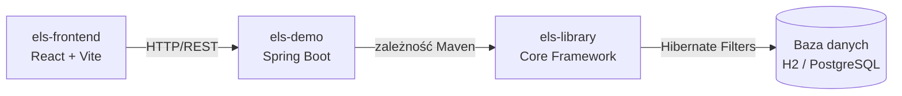
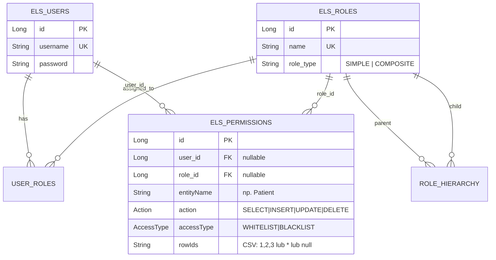
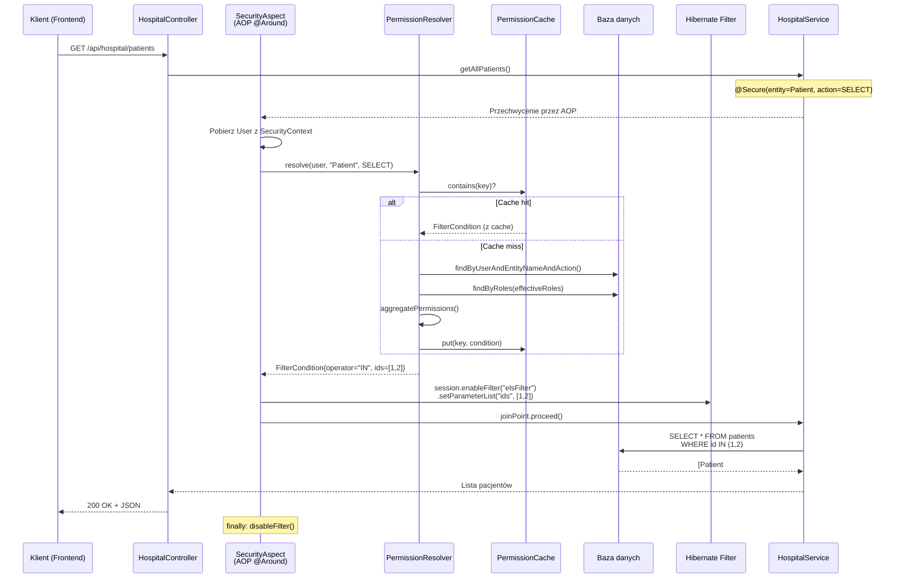
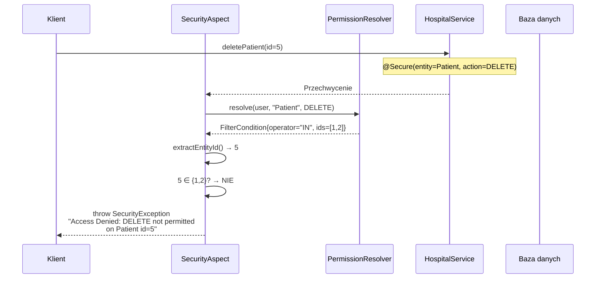
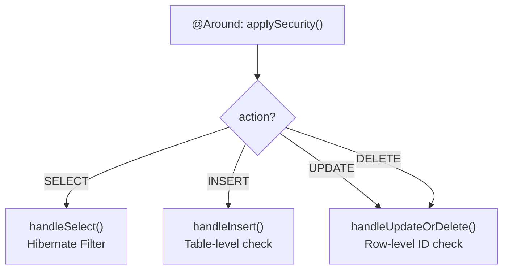
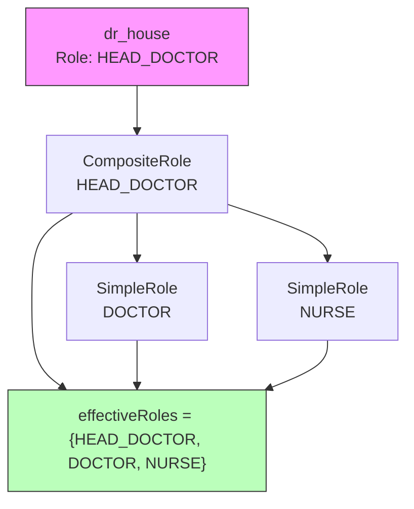
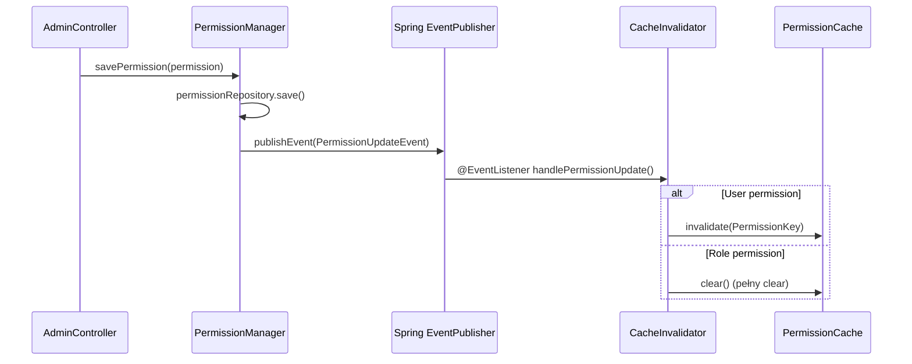
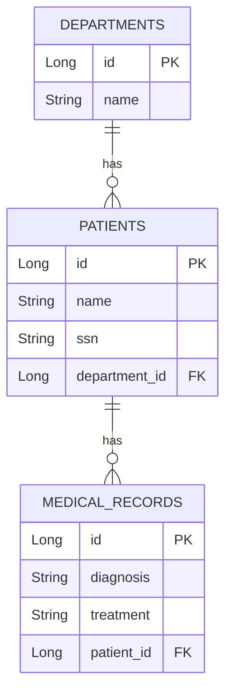

# Entity Level Security (ELS)

**Biblioteka bezpieczeństwa na poziomie encji dla aplikacji Java/Spring Boot**

ELS to framework zapewniający granularną kontrolę dostępu do danych na poziomie poszczególnych wierszy w bazie danych. W przeciwieństwie do tradycyjnych systemów RBAC, które operują na poziomie endpointów lub tablic, ELS kontroluje **które konkretne rekordy** dany użytkownik może zobaczyć, dodać, edytować lub usunąć.

---

## Spis treści

1. [Architektura projektu](#architektura-projektu)
2. [Stos technologiczny](#stos-technologiczny)
3. [Model domenowy ELS](#model-domenowy-els)
4. [Mechanizm działania biblioteki](#mechanizm-działania-biblioteki)
5. [Adnotacja @Secure](#adnotacja-secure)
6. [SecurityAspect – przechwytywanie operacji](#securityaspect--przechwytywanie-operacji)
7. [PermissionResolver – rozstrzyganie uprawnień](#permissionresolver--rozstrzyganie-uprawnień)
8. [Hierarchia decyzyjna](#hierarchia-decyzyjna)
9. [Wzorce projektowe](#wzorce-projektowe)
10. [System cache'owania](#system-cacheowania)
11. [Integracja z aplikacją konsumencką](#integracja-z-aplikacją-konsumencką)
12. [Aplikacja demonstracyjna (els-demo)](#aplikacja-demonstracyjna-els-demo)
13. [Frontend (els-frontend)](#frontend-els-frontend)
14. [Uruchomienie](#uruchomienie)

---

## Architektura projektu

Projekt składa się z trzech modułów Maven:

```
els-root/
├── els-library/        ← Główna biblioteka ELS (framework)
├── els-demo/           ← Aplikacja demonstracyjna (Spring Boot backend)
└── els-frontend/       ← Interfejs użytkownika (React + Vite)
```

Zależność jest jednokierunkowa:



Kluczowa zasada: **cała logika kontroli dostępu rezyduje wyłącznie w `els-library`**. Aplikacja konsumencka (`els-demo`) jedynie deklaruje intencje za pomocą adnotacji `@Secure`, a biblioteka automatycznie egzekwuje reguły.

---

## Stos technologiczny

| Komponent | Technologia | Wersja |
|-----------|-------------|--------|
| Język | Java | 21 |
| Framework | Spring Boot | 3.2.x |
| ORM | Hibernate / Spring Data JPA | 6.x |
| AOP | Spring AOP (AspectJ) | via `spring-boot-starter-aop` |
| Baza danych | H2 (demo) / PostgreSQL (produkcja) | — |
| Frontend | React + Vite | 18.x |
| Build | Maven (multi-module) | — |

---

## Model domenowy ELS

### Diagram encji biblioteki



### Klasy domenowe

#### `User`
Reprezentuje użytkownika systemu. Użytkownik ma zbiór ról (`Set<Role>`) ładowanych eagerly (`FetchType.EAGER`), co gwarantuje dostępność ról podczas resolucji uprawnień.

```java
@Entity
@Table(name = "els_users")
public class User {
    private Long id;
    private String username;
    private String password;
    
    @ManyToMany(fetch = FetchType.EAGER)
    @JoinTable(name = "user_roles")
    private Set<Role> roles = new HashSet<>();
}
```

#### `Role` (abstrakcyjna) → `SimpleRole` / `CompositeRole`

System ról wykorzystuje **wzorzec Composite** z dziedziczeniem Single Table:

```java
@Entity
@Table(name = "els_roles")
@Inheritance(strategy = InheritanceType.SINGLE_TABLE)
@DiscriminatorColumn(name = "role_type")
public abstract class Role {
    private Long id;
    private String name;
}
```

- **`SimpleRole`** — liść drzewa, prosta rola (np. `DOCTOR`, `NURSE`)
- **`CompositeRole`** — węzeł drzewa, zawiera kolekcję ról dzieci (np. `HEAD_DOCTOR` = `DOCTOR` + `NURSE`)

```java
@Entity
@DiscriminatorValue("COMPOSITE")
public class CompositeRole extends Role {
    @ManyToMany(fetch = FetchType.EAGER)
    @JoinTable(name = "role_hierarchy",
        joinColumns = @JoinColumn(name = "parent_role_id"),
        inverseJoinColumns = @JoinColumn(name = "child_role_id"))
    private Set<Role> children = new HashSet<>();
}
```

Dzięki temu `HEAD_DOCTOR` **automatycznie dziedziczy** wszystkie uprawnienia swoich ról składowych.

#### `Permission`

Centralna encja systemu bezpieczeństwa. Łączy podmiot (user lub role) z obiektem (entityName + action) i definiuje typ dostępu:

| Pole | Typ | Opis |
|------|-----|------|
| `user` | `User` (nullable) | Przypisanie bezpośrednie do użytkownika |
| `role` | `Role` (nullable) | Przypisanie do roli |
| `entityName` | `String` | Nazwa encji, np. `"Patient"` |
| `action` | `Action` enum | `SELECT`, `INSERT`, `UPDATE`, `DELETE` |
| `accessType` | `AccessType` enum | `WHITELIST` lub `BLACKLIST` |
| `rowIds` | `String` | CSV listy ID: `"1,2,3"`, wildcard `"*"`, lub `null` |

> **Ważne:** Dokładnie jedno z pól `user`/`role` powinno być ustawione. Jeśli `user != null`, to jest uprawnienie bezpośrednie (user-specific). Jeśli `role != null`, to jest uprawnienie przypisane do roli.

#### `Action` (enum)

```java
public enum Action {
    SELECT,    // Odczyt danych
    INSERT,    // Dodawanie nowych rekordów
    UPDATE,    // Modyfikacja istniejących rekordów
    DELETE     // Usuwanie rekordów
}
```

Każda akcja jest egzekwowana inaczej przez `SecurityAspect` (szczegóły poniżej).

#### `AccessType` (enum)

```java
public enum AccessType {
    WHITELIST,  // Jawnie DOZWOLONE – tylko wymienione ID
    BLACKLIST   // Jawnie ZABRONIONE – wszystko oprócz wymienionych ID
}
```

---

## Mechanizm działania biblioteki

### Przepływ bezpieczeństwa (sekwencja)



### Przepływ dla operacji zapisu



---

## Adnotacja @Secure

```java
@Target({ElementType.METHOD, ElementType.TYPE})
@Retention(RetentionPolicy.RUNTIME)
public @interface Secure {
    Action action() default Action.SELECT;
    Class<?> entity();
}
```

Adnotacja deklaratywna, nakładana na metody serwisowe. Nie zawiera żadnej logiki — pełni rolę **markera** przechwycenia AOP.

### Użycie

```java
@Secure(entity = Patient.class, action = Action.SELECT)
@Transactional(readOnly = true)
public List<Patient> getAllPatients() {
    return patientRepository.findAll();
}

@Secure(entity = Patient.class, action = Action.DELETE)
@Transactional
public void dischargePatient(Long patientId) {
    patientRepository.deleteById(patientId);
}
```

Biblioteka automatycznie wyciąga `entity().getSimpleName()` (np. `"Patient"`) i używa go do wyszukiwania reguł w tabeli `els_permissions`.

---

## SecurityAspect – przechwytywanie operacji

`SecurityAspect` to centralny komponent egzekwujący bezpieczeństwo. Działa jako aspekt AOP z adnotacją `@Around`, przechwytując **każde** wywołanie metody oznaczonej `@Secure`.

### Rozgałęzienie na typ akcji

Aspekt rozróżnia cztery typy operacji i obsługuje je odmiennymi mechanizmami:



### SELECT — filtrowanie na poziomie bazy danych

Dla operacji odczytu ELS wykorzystuje **Hibernate Filters** — mechanizm wbudowany w Hibernate, który dynamicznie dodaje klauzulę `WHERE` do zapytań SQL.

Encje konsumenckie muszą deklarować filtry za pomocą adnotacji:

```java
// Na pakiecie (package-info.java) — definicja filtra
@FilterDef(name = "elsFilter", parameters = @ParamDef(name = "ids", type = Long.class))
@FilterDef(name = "elsBlacklistFilter", parameters = @ParamDef(name = "ids", type = Long.class))
package com.els.demo.domain;

// Na encji — aktywacja filtra
@Entity
@Filter(name = "elsFilter", condition = "id IN (:ids)")
@Filter(name = "elsBlacklistFilter", condition = "id NOT IN (:ids)")
public class Patient { ... }
```

Aspekt aktywuje odpowiedni filtr przed wywołaniem metody, a deaktywuje go w bloku `finally`:

| FilterCondition | Aktywowany filtr | Efekt SQL |
|----------------|-----------------|-----------|
| `ALL` | żaden | `SELECT * FROM patients` (bez filtra) |
| `NONE` | `elsFilter` z `ids=[-1]` | `WHERE id IN (-1)` → puste wyniki |
| `IN [1,2,3]` | `elsFilter` z `ids=[1,2,3]` | `WHERE id IN (1,2,3)` |
| `NOT IN [5]` | `elsBlacklistFilter` z `ids=[5]` | `WHERE id NOT IN (5)` |

> **Technikalia: operator `NONE`** — zamiast zwracać pustą listę programowo, ELS ustawia filtr `IN (-1)` (ID = -1 nigdy nie istnieje), co powoduje że Hibernate zwraca pusty resultset. Dzięki temu zachowana jest spójność: zawsze idzie zapytanie do bazy, bo ręcznie zwrócona pusta lista ominęłaby transakcję i mogła prowadzić do side-effectów.

### INSERT — sprawdzanie na poziomie tabeli

INSERT nie operuje na konkretnych ID (rekordu jeszcze nie ma), więc sprawdzenie jest binarne:

- Jeśli `FilterCondition.operator == "ALL"` → metoda przechodzi (`proceed()`)
- W **każdym innym przypadku** (`NONE`, `IN`, `NOT IN`) → `throw SecurityException`

Reguła INSERT w bazie: `accessType = WHITELIST`, `rowIds = null`:

```java
createPermission(null, doctorRole, "Patient", Action.INSERT, AccessType.WHITELIST, null);
```

### UPDATE / DELETE — walidacja na poziomie wiersza

Dla operacji modyfikacji i usuwania, aspekt:

1. **Wyciąga ID encji z argumentów metody** (refleksja)
2. **Porównuje ID z rozstrzygniętym zbiorem uprawnień**

Ekstrakcja ID obsługuje dwie konwencje:

```java
// Konwencja 1: argument to Long (np. deleteById(Long id))
if (firstArg instanceof Long id) return id;

// Konwencja 2: argument to encja z getId()
Method getIdMethod = firstArg.getClass().getMethod("getId");
Object idValue = getIdMethod.invoke(firstArg);
```

Walidacja:

| Operator | Logika | Przykład |
|----------|--------|---------|
| `ALL` | Zawsze dozwolone | Admin z `WHITELIST *` |
| `NONE` | Zawsze zabronione | Brak uprawnień |
| `IN [1,2,3]` | `targetId ∈ {1,2,3}?` | Doctor może UPDATE pacjenta 1, ale nie 5 |
| `NOT IN [5]` | `targetId ∉ {5}?` | Blacklist: nie pozwalaj na modyfikację pacjenta 5 |

Jeśli walidacja nie przechodzi → `throw SecurityException("Access Denied: DELETE not permitted on Patient id=5.")`.

---

## PermissionResolver – rozstrzyganie uprawnień

`PermissionResolver` to mózg systemu — przetwarza surowe reguły `Permission` na konkretną decyzję `FilterCondition`.

### Algorytm resolucji (krok po kroku)

```
WEJŚCIE: User, entityName, Action
WYJŚCIE: FilterCondition { operator: String, ids: List<Object> }

1. Sprawdź cache PermissionKey(username, entity, action)
   → Jeśli hit: zwróć natychmiast

2. Zbierz efektywne role:
   - Dla każdej roli użytkownika:
     - Jeśli SimpleRole → dodaj do zbioru
     - Jeśli CompositeRole → rekurencyjnie rozwiń children (DFS)

3. Pobierz uprawnienia z bazy:
   - User-specific: findByUserAndEntityNameAndAction(user, entity, action)
   - Role-specific: findByRoles(effectiveRoles, entity, action)
   - ZSUMUJ obie listy

4. Agreguj uprawnienia → FilterCondition

5. Zapisz wynik w cache
```

### Rozwijanie ról hierarchicznych



Metoda `collectRoles()` rekurencyjnie schodzi po drzewie `CompositeRole.getChildren()`:

```java
private void collectRoles(Role root, Set<Role> accumulator) {
    accumulator.add(root);
    if (root instanceof CompositeRole composite) {
        for (Role child : composite.getChildren()) {
            collectRoles(child, accumulator);
        }
    }
}
```

Dzięki temu `dr_house` (który ma rolę `HEAD_DOCTOR`) efektywnie posiada uprawnienia `HEAD_DOCTOR` + `DOCTOR` + `NURSE`.

---

## Hierarchia decyzyjna

Agregacja uprawnień (`aggregatePermissions`) to najważniejszy algorytm w systemie. Zbiera wszystkie uprawnienia (z user-specific i role-specific) do dwóch zbiorów i podejmuje decyzję w ściśle określonej kolejności priorytetów.

### Dla akcji SELECT / UPDATE / DELETE

```mermaid
flowchart TD
    START["Zbierz wszystkie Permission<br/>dla (user, entity, action)"] --> LOOP["Iteruj po permissions"]
    LOOP --> WL{WHITELIST?}
    WL -->|Tak + ids="*"| A1["allowAll = true"]
    WL -->|Tak + ids="1,2"| A2["allowedIds ∪= {1,2}"]
    WL -->|Nie → BLACKLIST| BL{ids?}
    BL -->|ids="*"| B1["denyAll = true"]
    BL -->|ids="5"| B2["deniedIds ∪= {5}"]
    
    A1 --> DECIDE
    A2 --> DECIDE
    B1 --> DECIDE
    B2 --> DECIDE
    
    DECIDE["Hierarchia decyzyjna"] --> P1{"① denyAll?"}
    P1 -->|Tak| R1["NONE<br/>(brak dostępu)"]
    P1 -->|Nie| P2{"② hasWhitelist?"}
    P2 -->|Nie| P3{"③ deniedIds ≠ ∅?"}
    P3 -->|Tak| R2["NOT IN (deniedIds)<br/>(wszystko oprócz)"]
    P3 -->|Nie| R3["NONE<br/>(deny by default)"]
    P2 -->|Tak| P4{"④ allowAll?"}
    P4 -->|Tak| P5{"⑤ deniedIds ≠ ∅?"}
    P5 -->|Tak| R4["NOT IN (deniedIds)<br/>(wildcart minus wyjątki)"]
    P5 -->|Nie| R5["ALL<br/>(pełny dostęp)"]
    P4 -->|Nie| P6["⑥ allowedIds -= deniedIds"]
    P6 --> P7{"⑦ allowedIds ≠ ∅?"}
    P7 -->|Tak| R6["IN (allowedIds)<br/>(tylko te ID)"]
    P7 -->|Nie| R7["NONE<br/>(wszystko odfiltrowane)"]

    style R1 fill:#fcc
    style R3 fill:#fcc
    style R7 fill:#fcc
    style R5 fill:#cfc
    style R6 fill:#cfc
    style R2 fill:#ffc
    style R4 fill:#ffc
```

### Tabela priorytetów

| Priorytet | Warunek | Wynik (`FilterCondition`) | Opis |
|:---------:|---------|:-------------------------:|------|
| **1** (najwyższy) | `BLACKLIST *` (denyAll) | `NONE` | Absolutne blokowanie — nadrzędne nad wszystkim |
| **2** | Brak jakiegokolwiek WHITELIST | `NOT IN (deniedIds)` lub `NONE` | Jeśli są tylko blacklisty z konkretnymi ID → „wszystko oprócz tych". Jeśli brak reguł → deny by default |
| **3** | `WHITELIST *` + blacklist IDs | `NOT IN (deniedIds)` | Pełny dostęp z wyjątkami |
| **4** | `WHITELIST *` bez blacklistów | `ALL` | Pełny, nieograniczony dostęp |
| **5** | Konkretne whitelist IDs | `IN (allowedIds - deniedIds)` | Suma dozwolonych ID minus zabronione |
| **6** (najniższy) | Puste wynikowe ID | `NONE` | Blacklist odfiltrował wszystkie dozwolone ID |

### Kluczowe zasady

1. **`BLACKLIST *` zawsze wygrywa** — ma absolutny, najwyższy priorytet, niezależnie od ilości whitelist-ów
2. **Kolejność definicji reguł NIE ma znaczenia** — system zbiera wszystkie reguły do zbiorów i agreguje je
3. **Deny by default** — brak jakiejkolwiek reguły = brak dostępu (`NONE`)
4. **Additive whitelists** — wiele whitelist-ów z różnych ról sumuje się (unia zbiorów)
5. **Subtractive blacklists** — blacklisty odejmują z whitelistów (różnica zbiorów)
6. **Uprawnienia user-specific i role-specific są traktowane jednakowo** — nie ma priorytetu jednych nad drugimi

### Przykłady agregacji

#### Przykład 1: Prosty whitelist
```
Reguła DOCTOR/Patient/SELECT: WHITELIST [1,2]
Reguła NURSE/Patient/SELECT:  WHITELIST [4,5]
Użytkownik ma obie role.

allowedIds = {1,2,4,5}    deniedIds = {}
→ FilterCondition("IN", [1,2,4,5])
→ SQL: WHERE id IN (1,2,4,5)
```

#### Przykład 2: Whitelist + Blacklist
```
Reguła DOCTOR/Patient/SELECT: WHITELIST [1,2,3]
Reguła NURSE/Patient/SELECT:  BLACKLIST [2]

allowedIds = {1,2,3}      deniedIds = {2}
→ allowedIds.removeAll(deniedIds) → {1,3}
→ FilterCondition("IN", [1,3])
```

#### Przykład 3: Wildcard whitelist z wyjątkiem
```
Reguła ADMIN/Patient/SELECT:  WHITELIST [*]
Reguła POLICY/Patient/SELECT: BLACKLIST [999]

allowAll = true            deniedIds = {999}
→ FilterCondition("NOT IN", [999])
→ SQL: WHERE id NOT IN (999)
```

#### Przykład 4: Blacklist wildcard nadrzędność
```
Reguła ADMIN/Patient/SELECT:  WHITELIST [*]
Reguła BAN/Patient/SELECT:    BLACKLIST [*]

denyAll = true (priorytet 1)
→ FilterCondition("NONE", [])
→ SQL: WHERE id IN (-1) → puste wyniki
```

### Dla akcji INSERT

INSERT posiada uproszczoną logikę, ponieważ nie operuje na konkretnych ID (nowy rekord nie ma jeszcze ID):

```
Jeśli JAKAKOLWIEK reguła ma accessType = WHITELIST → FilterCondition("ALL", [])
W przeciwnym razie → FilterCondition("NONE", [])
```

Reguła INSERT w bazie ma `rowIds = null`:
```java
Permission.builder()
    .role(doctorRole)
    .entity("Patient")
    .action(Action.INSERT)
    .accessType(AccessType.WHITELIST)
    .rowIds(null)          // ← null, bo INSERT nie operuje na ID
    .build();
```

---

## Wzorce projektowe

ELS wykorzystuje następujące wzorce projektowe:

### 1. Strategy Pattern — `AccessStrategy`

```java
public interface AccessStrategy {
    FilterCondition generateCondition(List<Object> rowIds);
    record FilterCondition(String operator, List<Object> ids) {}
}
```

Dwie implementacje:

| Strategia | Generowany operator | Efekt |
|-----------|-------------------|-------|
| `WhitelistStrategy` | `"IN"` | `WHERE id IN (ids)` |
| `BlacklistStrategy` | `"NOT IN"` | `WHERE id NOT IN (ids)` |

`FilterCondition` to record (Java 16+), transportujący decyzję z resolvera do aspektu. Pole `operator` przyjmuje wartości: `"ALL"`, `"NONE"`, `"IN"`, `"NOT IN"`.

### 2. Composite Pattern — `Role` → `SimpleRole` / `CompositeRole`

Hierarchia ról tworzy strukturę drzewiastą:

```
HEAD_DOCTOR (CompositeRole)
├── DOCTOR (SimpleRole)
└── NURSE (SimpleRole)
```

`PermissionResolver.collectRoles()` rekurencyjnie rozwiązuje całe drzewo, spłaszczając je do `Set<Role>`. Dzięki temu uprawnienia z dowolnego poziomu hierarchii są zbierane.

### 3. Observer Pattern — `PermissionUpdateEvent` + `CacheInvalidator`

Wzorzec Observer zapewnia spójność cache po zmianach uprawnień:



**Strategia inwalidacji:**
- **Zmiana uprawnień użytkownika** → punktowa inwalidacja klucza `PermissionKey(username, entity, action)`
- **Zmiana uprawnień roli** → pełne wyczyszczenie cache (bo zmiana roli wpływa na nieznaną liczbę użytkowników z tą rolą)

### 4. Flyweight Pattern — `PermissionCache`

Cache przechowuje rozwiązane `FilterCondition` jako obiekty współdzielone (rekordy Java są immutable):

```java
@Component
public class PermissionCache {
    private final Map<PermissionKey, FilterCondition> cache = new ConcurrentHashMap<>();
    
    public FilterCondition get(PermissionKey key) { return cache.get(key); }
    public void put(PermissionKey key, FilterCondition value) { cache.put(key, value); }
    public void invalidate(PermissionKey key) { cache.remove(key); }
    public void clear() { cache.clear(); }
}
```

Klucz: `record PermissionKey(String username, String entityName, Action action)` — unikalna kombinacja definiująca jeden „rodzaj" dostępu.

Dzięki cache, resolucja uprawnień (query do bazy + agregacja) odbywa się **tylko raz** per unikalny klucz. Kolejne wywołania zwracają obiekt z pamięci.

### 5. Builder Pattern — `Permission.Builder`

Fluent API do tworzenia reguł uprawnień:

```java
Permission permission = Permission.builder()
    .role(doctorRole)
    .entity("Patient")
    .action(Action.SELECT)
    .accessType(AccessType.WHITELIST)
    .rowIds("1,2,3")
    .build();
```

---

## System cache'owania

### Klucz cache

```java
record PermissionKey(String username, String entityName, Action action) {}
```

Przykładowe klucze:
- `("dr_house", "Patient", SELECT)` → `FilterCondition("IN", [1,2,3,4,5])`
- `("nurse_joy", "Patient", DELETE)` → `FilterCondition("NONE", [])`

### Cykl życia

```
1. Pierwsze żądanie: 
   SecurityAspect → PermissionResolver → [cache MISS] → DB query → aggregacja → cache PUT

2. Kolejne żądania:
   SecurityAspect → PermissionResolver → [cache HIT] → zwrot natychmiast

3. Admin zmienia uprawnienie:
   PermissionManager → savePermission() → publishEvent() → CacheInvalidator → cache INVALIDATE

4. Następne żądanie:
   [cache MISS] → DB query → ... (cykl się powtarza)
```

### Thread safety

`PermissionCache` używa `ConcurrentHashMap`, gwarantując bezpieczeństwo wątkowe w środowisku wielowątkowym serwera aplikacji.

---

## SecurityContext — kontekst użytkownika

`SecurityContext` utrzymuje informację o aktualnie zalogowanym użytkowniku w `ThreadLocal`:

```java
@Component
public class SecurityContext {
    private static final ThreadLocal<User> currentUser = new ThreadLocal<>();
    
    public void setCurrentUser(User user) { currentUser.set(user); }
    public User getCurrentUser() { return currentUser.get(); }
    public void clear() { currentUser.remove(); }
}
```

`ThreadLocal` gwarantuje izolację między równoległymi żądaniami HTTP — każdy wątek (request) ma własną instancję użytkownika.

Aplikacja konsumencka odpowiada za ustawienie kontekstu (np. poprzez filtr HTTP — `UserContextFilter` w `els-demo`).

---

## Integracja z aplikacją konsumencką

### Wymagane kroki integracji

#### 1. Dodaj zależność Maven
```xml
<dependency>
    <groupId>com.els</groupId>
    <artifactId>els-library</artifactId>
    <version>1.0.0-SNAPSHOT</version>
</dependency>
```

#### 2. Dodaj Hibernate FilterDefs na pakiecie
```java
// package-info.java
@FilterDef(name = "elsFilter", parameters = @ParamDef(name = "ids", type = Long.class))
@FilterDef(name = "elsBlacklistFilter", parameters = @ParamDef(name = "ids", type = Long.class))
package com.example.domain;
```

#### 3. Oznacz encje filtrami Hibernate
```java
@Entity
@Filter(name = "elsFilter", condition = "id IN (:ids)")
@Filter(name = "elsBlacklistFilter", condition = "id NOT IN (:ids)")
public class MyEntity { ... }
```

#### 4. Oznacz metody serwisowe adnotacją @Secure
```java
@Secure(entity = MyEntity.class, action = Action.SELECT)
public List<MyEntity> getAll() {
    return repository.findAll();
}

@Secure(entity = MyEntity.class, action = Action.DELETE)
public void delete(Long id) {
    repository.deleteById(id);
}
```

#### 5. Ustaw SecurityContext przed wywołaniem
```java
// np. w filtrze HTTP
@Override
public void doFilter(...) {
    User user = userRepository.findById(userId);
    securityContext.setCurrentUser(user);
    try {
        chain.doFilter(request, response);
    } finally {
        securityContext.clear();
    }
}
```

#### 6. Zdefiniuj uprawnienia w bazie
```java
permissionManager.savePermission(
    Permission.builder()
        .role(myRole)
        .entity("MyEntity")
        .action(Action.SELECT)
        .accessType(AccessType.WHITELIST)
        .rowIds("1,2,3")
        .build()
);
```

---

## Aplikacja demonstracyjna (els-demo)

### Domena: System Zarządzania Szpitalem

Aplikacja demonstruje ELS w kontekście medycznym z trzema encjami:



### Predefiniowani użytkownicy

| Użytkownik | Hasło | Role | Opis |
|------------|-------|------|------|
| `admin` | `admin` | `ADMIN` | Pełny dostęp CRUD do wszystkich encji |
| `dr_house` | `password` | `HEAD_DOCTOR` (= `DOCTOR` + `NURSE`) | Widzi pacjentów z obu ról + własny pacjent (p3) |
| `dr_strange` | `password` | `DOCTOR` | Widzi pacjentów 1, 2; pełny CRUD na rekordach |
| `nurse_joy` | `password` | `NURSE` | Widzi pacjentów 4, 5; brak DELETE na rekordach |

### Matryca uprawnień

#### Department

| Rola | SELECT | INSERT | UPDATE | DELETE |
|------|--------|--------|--------|--------|
| `ADMIN` | `WHITELIST *` | `WHITELIST` | `WHITELIST *` | `WHITELIST *` |
| `DOCTOR` | `WHITELIST *` | — | — | — |
| `NURSE` | `WHITELIST *` | — | — | — |

#### Patient

| Rola | SELECT | INSERT | UPDATE | DELETE |
|------|--------|--------|--------|--------|
| `ADMIN` | `WHITELIST *` | `WHITELIST` | `WHITELIST *` | `WHITELIST *` |
| `DOCTOR` | `WHITELIST [1,2]` | `WHITELIST` | — | — |
| `NURSE` | `WHITELIST [4,5]` | `WHITELIST` | — | — |
| `dr_house` (user) | `WHITELIST [3]` | — | — | — |

> **dr_house jako HEAD_DOCTOR**: dziedziczy DOCTOR (widzi 1,2) + NURSE (widzi 4,5), a jego user-specific whitelist dodaje 3. Po agregacji: `IN [1,2,3,4,5]` — widzi wszystkich 5 pacjentów.

#### MedicalRecord

| Rola | SELECT | INSERT | UPDATE | DELETE |
|------|--------|--------|--------|--------|
| `ADMIN` | `WHITELIST *` | `WHITELIST` | `WHITELIST *` | `WHITELIST *` |
| `DOCTOR` | `WHITELIST *` | `WHITELIST` | `WHITELIST *` | `WHITELIST *` |
| `NURSE` | `WHITELIST *` | `WHITELIST` | `WHITELIST *` | — |

### Obsługa błędów

`GlobalExceptionHandler` (`@RestControllerAdvice`) mapuje wyjątki na odpowiednie kody HTTP:

| Wyjątek | HTTP Status | Kiedy |
|---------|:-----------:|-------|
| `SecurityException` | `403 Forbidden` | Brak uprawnień ELS |
| `DataIntegrityViolationException` | `409 Conflict` | Naruszenie FK/unique |
| `EntityNotFoundException` | `404 Not Found` | Encja nie istnieje |

Odpowiedź JSON:
```json
{
  "error": "ACCESS_DENIED",
  "message": "Access Denied: DELETE not permitted on Patient id=5."
}
```

### Cascade Delete

`Patient` posiada relację `@OneToMany` z `CascadeType.ALL` do `MedicalRecord`. Usunięcie pacjenta automatycznie usuwa wszystkie jego rekordy medyczne.

### API Endpoints

| Metoda | Endpoint | Akcja ELS |
|--------|----------|-----------|
| `GET` | `/api/hospital/departments` | `SELECT Department` |
| `POST` | `/api/hospital/departments` | `INSERT Department` |
| `PUT` | `/api/hospital/departments/{id}` | `UPDATE Department` |
| `DELETE` | `/api/hospital/departments/{id}` | `DELETE Department` |
| `GET` | `/api/hospital/patients` | `SELECT Patient` |
| `POST` | `/api/hospital/patients` | `INSERT Patient` |
| `PUT` | `/api/hospital/patients/{id}` | `UPDATE Patient` |
| `DELETE` | `/api/hospital/patients/{id}` | `DELETE Patient` |
| `GET` | `/api/hospital/records` | `SELECT MedicalRecord` |
| `POST` | `/api/hospital/records` | `INSERT MedicalRecord` |
| `PUT` | `/api/hospital/records/{id}` | `UPDATE MedicalRecord` |
| `DELETE` | `/api/hospital/records/{id}` | `DELETE MedicalRecord` |

---

## Frontend (els-frontend)

Aplikacja React zbudowana z Vite, składająca się z:

- **Login** — formularz logowania z uwierzytelnianiem sesyjnym
- **Hospital Dashboard** — zakładki Departments / Patients / Medical Records z pełnym CRUD
- **Admin Panel** — zarządzanie użytkownikami, rolami i uprawnieniami

### Obsługa błędów ELS

Frontend przechwytuje odpowiedzi HTTP i wyświetla toast-notyfikacje:
- `403` → 🔒 Access Denied z komunikatem z els-library
- `409` → ⚠️ Conflict (naruszenie klucza obcego)
- Inne → ❌ ogólny komunikat błędu

---

## Uruchomienie

### Wymagania
- Java 21+
- Maven 3.8+
- Node.js 18+

### Backend
```bash
# Z katalogu głównego projektu
mvn clean install
cd els-demo
mvn spring-boot:run
```
Serwer startuje na `http://localhost:8080`.

### Frontend
```bash
cd els-frontend
npm install
npm run dev
```
Frontend startuje na `http://localhost:5173`.

### Docker (opcjonalnie)
```bash
docker-compose up
```

---

## Struktura plików els-library

```
els-library/src/main/java/com/els/
├── annotation/
│   └── Secure.java              # Adnotacja @Secure (marker AOP)
├── aspect/
│   └── SecurityAspect.java      # Główny aspekt AOP (przechwytywanie + egzekwowanie)
├── cache/
│   ├── PermissionCache.java     # In-memory cache (ConcurrentHashMap)
│   └── PermissionKey.java       # Klucz cache (record)
├── context/
│   └── SecurityContext.java     # ThreadLocal kontekst użytkownika
├── domain/
│   ├── AccessType.java          # Enum: WHITELIST, BLACKLIST
│   ├── Action.java              # Enum: SELECT, INSERT, UPDATE, DELETE
│   ├── CompositeRole.java       # Rola złożona (wzorzec Composite)
│   ├── Permission.java          # Encja uprawnień + Builder
│   ├── Role.java                # Abstrakcyjna klasa bazowa ról
│   ├── SimpleRole.java          # Prosta rola (liść)
│   └── User.java                # Encja użytkownika
├── event/
│   ├── CacheInvalidator.java    # Observer: inwalidacja cache
│   └── PermissionUpdateEvent.java # Zdarzenie aktualizacji uprawnień
├── manager/
│   └── PermissionManager.java   # CRUD uprawnień + event publishing
├── repository/
│   ├── PermissionRepository.java # Zapytania do els_permissions
│   ├── RoleRepository.java      # Zapytania do els_roles
│   └── UserRepository.java      # Zapytania do els_users
├── service/
│   └── PermissionResolver.java  # Rozstrzyganie uprawnień (agregacja)
└── strategies/
    ├── AccessStrategy.java      # Interfejs strategii + FilterCondition record
    ├── BlacklistStrategy.java   # Implementacja: "NOT IN"
    └── WhitelistStrategy.java   # Implementacja: "IN"
```
